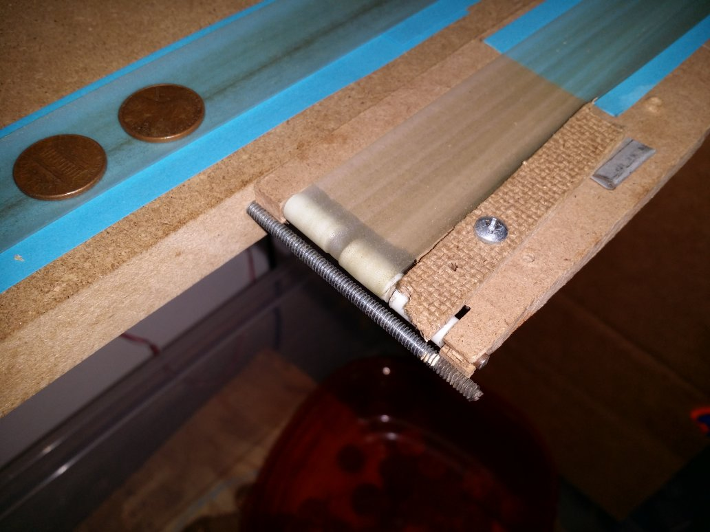
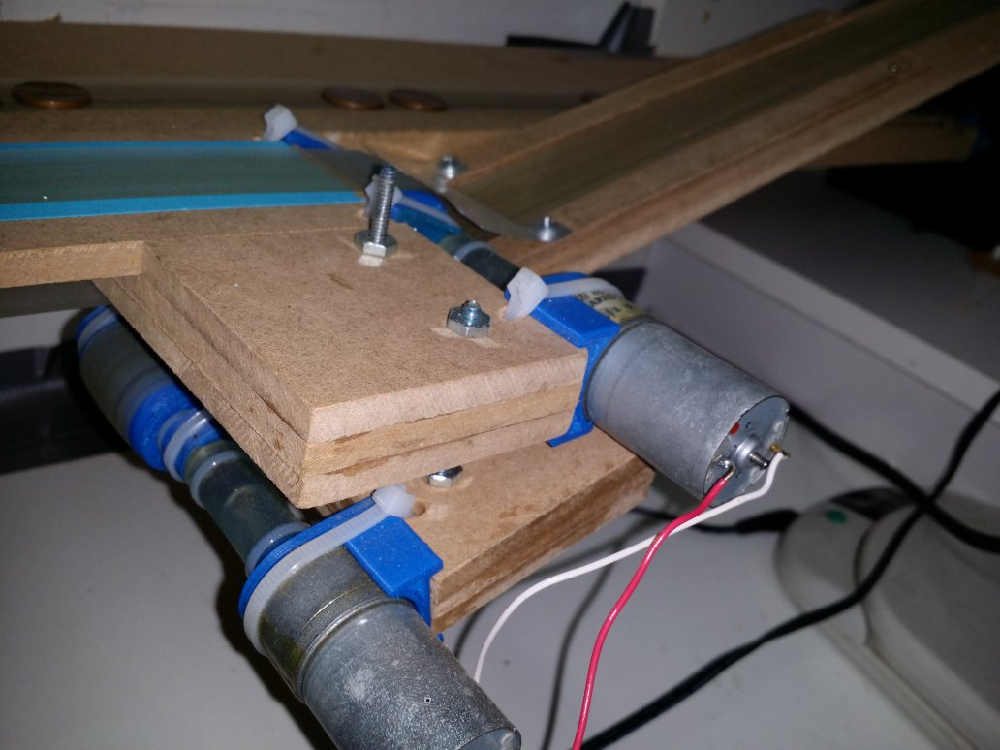
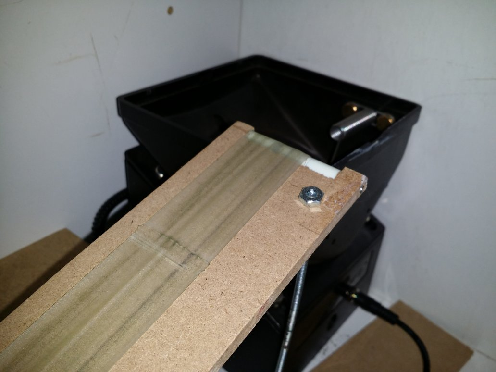
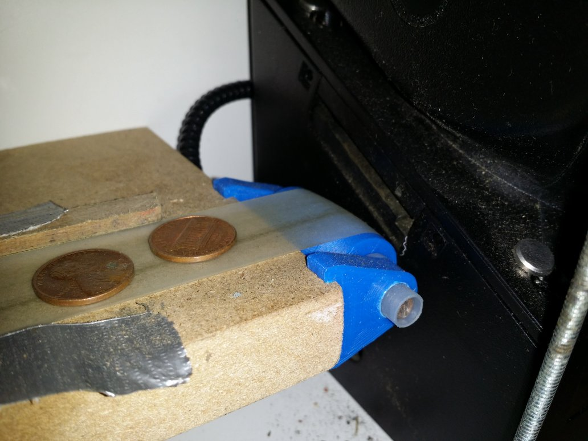
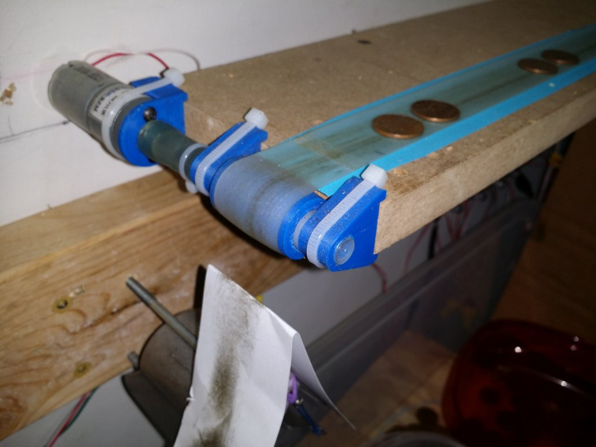

I don't think I will use this 3D Printed style again. The laser cut version is simpler and quicker to make. 

**Three types of conveyor ends have been used successfully:**
* Motor end in ¾” MDF
* Pulley end in ¾ MDF
* Pulley end in ¼ MDF

These conveyors built from ¾” frames have turned out way better than I thought they would. I first used 1mm thick belting at 100RPM and this was a bit under-powered. All the power is used to move the thicker belt under tension. It would move a full gallon of milk(3+ kilos) with no issues. 

With the 0.15mm thick belting that is currently be used the motors can be smaller, especially if you put in ball bearings. 

**Motor end in ¾” MDF Parts:**
* 25MM Gear motor, 4mm shaft 100-1000RPM
* 2 motor mount screws: M3-0.5 6 mm screws
* 3D printed gearbox bracket
* 3D printed D-coupling to take motor 4mm ID “D” to ¼” OD
* Coupling: Polyurethane Tubing, ½” OD, ¼” ID. 
* Coupling: Zip/cable Ties: 4”
* 75mm long ¼” steel shaft
* 35 mm long 3D printed pulley. 22mm diameter. 
* Drilled with “D”0.246” drill to press fit on ¼” shaft
* 2 3D printed Pulley Holders. 
* 2 Bushings: stock nylon shoulder spacers ½” Long, ¼” ID, 5/16” ID, ½” ID Flange
* 3 8” zip/cable ties hold on the gearbox bracket & pulley holders

**Pulley end in ¾ MDF**
* Same as motor side, except 60mm long shaft. 

**Pulley end in ¼” MDF:**
* Pulley end ¼” is 60mm wide
* 1/8” steel shaft, 60mm long
* 4 ¼” diameter nylon spacers, 1/8” hole, ½” long, Center spacer has tape to make it crown. 
* Wood is cutout for the pulleys
* Remaining wood is drilled 1/8”
* It’s pretty crude and fragile, but once it starts working I have yet to see fail. 
* It’s easy to drill so the shaft is not straight. Then the belt walks to one side. 
* In the pictures below the belt walked to one side anyway. It just did not matter. 

**Conveyor Belt:**
* 30mm wide, 0.15mm thick Polyurethane
* Normally used for sealing fabric together, under garment strapping, etc.
* Sold as “TPU Tape” on Aliexpress.com
* Length wise sized 5% under  
* Bonded together with a standard impulse heat sealer used for sealing poly plastic bags. 

**Speed Controllers:**
* The first proof of concept had 24V power stepped down to 5 to 18 volts for the 12V motors with DC-DC LM2596 modules. This are really common, $1-2 on eBay, Amazon, etc. The system moving coins with motors running at 5-7 volts is surprisingly quiet with the coin hopper turned off. 

